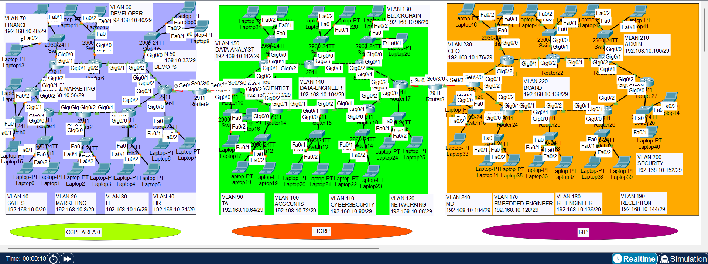

# enterprise-network-project
Enterprise Network Design and Simulation
# Enterprise Network Design Project

## 📌 Overview

This project demonstrates a real-world enterprise network designed using multiple routing protocols and VLAN segmentation. The network is divided into different routing domains (OSPF, EIGRP, RIP) with route redistribution configured to enable communication between all networks.

---

## ⚙️ Technologies Used

* OSPF
* EIGRP
* RIP
* Route Redistribution
* VLANs
* Inter-VLAN Routing
* Trunking (802.1Q)

---

## 🌐 Network Design

* Multiple VLANs created for department segmentation (Finance, Developer, Admin, Security)
* Separate routing domains:

  * OSPF Domain
  * EIGRP Domain
  * RIP Domain
* Route redistribution configured between protocols
* Trunk links between switches for VLAN communication

---

## 🖼️ Topology Diagram



---

## 🔥 Key Features

* Inter-VLAN routing configured
* Trunk links between switches
* Multi-routing protocol environment
* Route redistribution between OSPF, EIGRP, and RIP
* Scalable enterprise design

---

# ⚙️ Configurations

## 🔹 VLAN Configuration (Switch) Example

```bash
vlan 10
 name SALES
vlan 20
 name MARKETING
vlan 30
 name HR
vlan 40
 name IT
```

---

## 🔹 Trunk Configuration Example

```bash
interface g0/1
 switchport mode trunk
 switchport trunk allowed vlan all
```

---

## 🔹 Inter-VLAN Routing (Router-on-a-Stick) Example

```bash
interface g0/0.10
 encapsulation dot1Q 10
 ip address 192.168.10.1 255.255.255.0

interface g0/0.20
 encapsulation dot1Q 20
 ip address 192.168.20.1 255.255.255.0

interface g0/0.30
 encapsulation dot1Q 30
 ip address 192.168.30.1 255.255.255.0

interface g0/0.40
 encapsulation dot1Q 40
 ip address 192.168.40.1 255.255.255.0
```

---

## 🔹 OSPF Configuration Example

```bash
router ospf 1
 network 192.168.10.0 0.0.0.255 area 0
 network 10.0.0.0 0.0.0.3 area 0
```

---

## 🔹 EIGRP Configuration Example

```bash
router eigrp 100
 network 192.168.20.0
 network 10.0.1.0
 no auto-summary
```

---

## 🔹 RIP Configuration Example

```bash
router rip
 version 2
 network 192.168.30.0
 network 10.0.2.0
 no auto-summary
```

---

## 🔹 Route Redistribution Example

```bash
router ospf 1
 redistribute eigrp 100 subnets
 redistribute rip subnets

router eigrp 100
 redistribute ospf 1 metric 10000 100 255 1 1500
 redistribute rip

router rip
 redistribute ospf 1 metric 2
 redistribute eigrp 100 metric 2
```

---

## 📂 Note

Packet Tracer (.pkt) file is not included. Configuration example and topology diagram are provided for review.

---

## 🎯 Use Case

This project is useful for:

* Network Engineer roles
* NOC / Data Center roles
* CCNA / CCNP preparation

---

## 💡 Author

Your Name
Mustafa Indorewala
